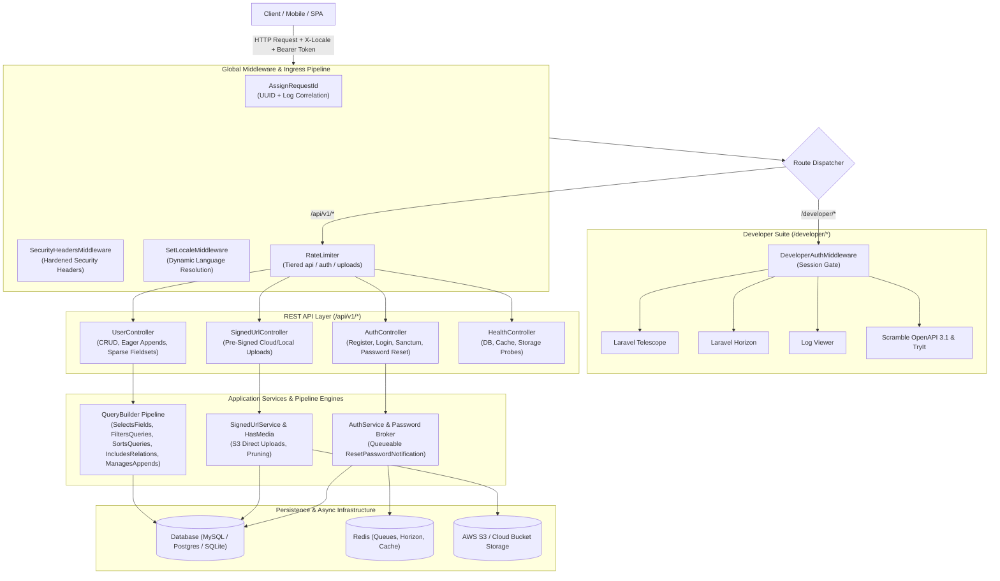
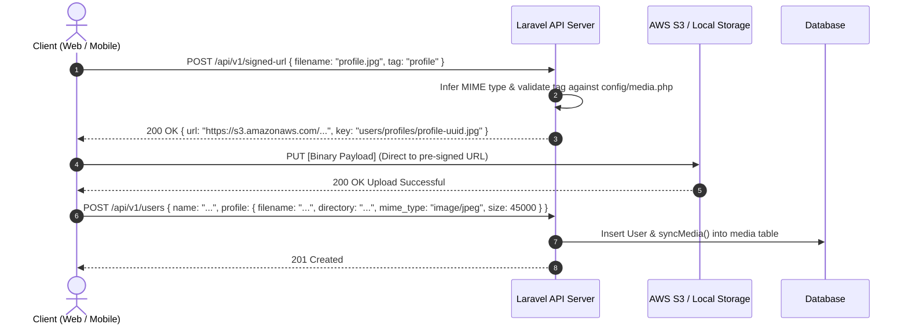
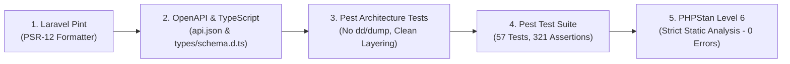

# 🏛️ Enterprise Laravel 13 API Architecture & Engineering Skills Playbook

This playbook documents the technical architecture, development workflows, specialized domain skills, and code design patterns for building and scaling high-throughput APIs on this Laravel 13 boilerplate.

---

## 📑 System Blueprint & Architecture Map



---

## ⚡ Skill 1: Zero N+1 REST API Query Engineering

The query engine is split into 5 single-responsibility traits located in `app/Queries/Concerns/`:

```
app/Queries/
├── Concerns/
│   ├── FiltersQueries.php    # Dynamic ?filter[col]=val, date bounds (_after, _before), & ?search=term
│   ├── IncludesRelations.php # Whitelisted ?include=rel eager loading & nested relation sparse fieldsets
│   ├── ManagesAppends.php    # Model $appends + ?append=... & #[RequiresRelation] N+1 resolution
│   ├── SelectsFields.php     # Root model sparse fieldsets (?fields=a,b) & hidden column exclusions
│   └── SortsQueries.php      # Multi-column ?sort=-created_at,name & default sorting
└── QueryBuilder.php          # Lean orchestrator pipeline (~180 lines)
```

### 1. Declaring Model Dependencies with `#[RequiresRelation]`
Computed accessors on Eloquent models declare required relations using the `#[RequiresRelation]` attribute:

```php
namespace App\Models;

use App\Attributes\RequiresRelation;
use Illuminate\Database\Eloquent\Casts\Attribute;

class User extends Authenticatable
{
    // ...

    #[RequiresRelation('tokens:id,tokenable_id,tokenable_type,name,created_at')]
    protected function latestTokenName(): Attribute
    {
        return Attribute::make(
            get: fn (?string $value): ?string => $value ?? (
                $this->relationLoaded('tokens') 
                    ? $this->tokens->sortByDesc('id')->first()?->name 
                    : null
            )
        );
    }
}
```

### 2. How the Pipeline Eliminates N+1:
1. Client requests `GET /api/v1/users?append=latest_token_name`.
2. `ManagesAppends` inspects `User::latestTokenName()` via reflection.
3. Automatically executes eager-load `$query->with('tokens:id,tokenable_id,tokenable_type,name,created_at')`.
4. Computes and sets the accessor value on each model.
5. If `'tokens'` was not explicitly in `?include=`, it strips the raw relation via `$item->unsetRelation('tokens')` so internal database columns are never leaked.

---

## ☁️ Skill 2: Pre-Signed Direct Cloud Upload Architecture

Direct client-to-cloud file uploads bypass server CPU/RAM bottlenecks for large media assets.

### 🔄 Direct Upload Lifecycle



### Media Rules Helper
Use `App\Rules\MediaRule` inside FormRequests:

```php
use App\Rules\MediaRule;

public function rules(): array
{
    return [
        'name'    => ['required', 'string', 'max:255'],
        'profile' => MediaRule::rules(config('media.tags.profile'), required: true),
    ];
}
```

### Automated Temp File Cleaner
Unattached uploaded files older than 2 days are pruned automatically via:
```bash
php artisan media:prune-temp --days=2
```

---

## 🔐 Skill 3: Queueable Authentication & Password Reset Flow

Password resets are processed asynchronously using `App\Notifications\Auth\ResetPasswordNotification`:

1. **Queueable Execution**: Implements `ShouldQueue` + `use Queueable` so email dispatch never blocks the HTTP response.
2. **Security**: The token parameter is guarded with `#[\SensitiveParameter]` to prevent exposure in exception logs.
3. **SPA / Mobile Deep Linking**: Formulates the frontend reset URL:
   `{FRONTEND_URL}/reset-password?token={TOKEN}&email={EMAIL}`
4. **Dynamic Override**: Supports `ResetPasswordNotification::createUrlUsing(...)` for custom multi-tenant or mobile deep link schemes.

---

## 🌐 Skill 4: Domain-Driven Topic-Based Localization

All translatable copy is partitioned into domain files under root `lang/en/`:

| File | Domain Concern | Example Usage |
|---|---|---|
| `entity.php` | Domain nouns & terms | `__('entity.user')` ➔ `"User"` |
| `message.php` | API CRUD feedback & errors | `__('message.users.created')` ➔ `"User created successfully."` |
| `status.php` | State and enum labels | `__('status.active')` ➔ `"Active"` |
| `email.php` | Email subjects, bodies, and CTAs | `__('email.welcome.subject')` ➔ `"Welcome to Laravel"` |
| `notification.php` | In-app and push notification text | `__('notification.account.password_changed_title')` |

### Dynamic Locale Resolution
Handled automatically by `SetLocaleMiddleware`:
- Evaluates `X-Locale` / `X-Language` header ➔ `?locale=...` param ➔ `Accept-Language` header.
- Sets `Content-Language` header on all outgoing responses.

---

## 🛠️ Skill 5: Developer Suite & Observability (`/developer/*`)

| Tool | Route | Security & Purpose |
|---|---|---|
| **Dashboard** | `/developer/dashboard` | Architecture metrics & unified launcher |
| **Telescope** | `/developer/telescope` | Deep database, request, queue, and mail debugging |
| **Horizon** | `/developer/horizon` | Real-time Redis background queue monitoring |
| **Log Viewer** | `/developer/log-viewer` | Full-text searchable structured log browser |
| **Scramble Docs** | `/developer/docs/api` | Live Stoplight Elements OpenAPI 3.1 playground |

---

## 🧪 Skill 6: Automated Pre-Commit Quality Gateway

The repository enforces a 5-stage automated quality pipeline before every commit:

```bash
$ ./.husky/pre-commit
```



---

## 🚀 Rapid Development Recipes

### Recipe: Scaffold a New API Resource
1. Create Migration: `php artisan make:migration create_posts_table`
2. Create Model with Fillable & Hidden: `app/Models/Post.php`
3. Add `use ApiQueryable, HasFactory;` to Model.
4. Create FormRequests: `StoreRequest.php` & `UpdateRequest.php`.
5. Create Resource: `PostResource.php`.
6. Create Controller using `BaseApiController`:
   ```php
   public function index(): JsonResponse {
       return $this->paginatedResponse(Post::apiQuery()->paginate(), PostResource::class);
   }
   ```
7. Run `./.husky/pre-commit` to re-generate TypeScript types and verify all quality checks.
